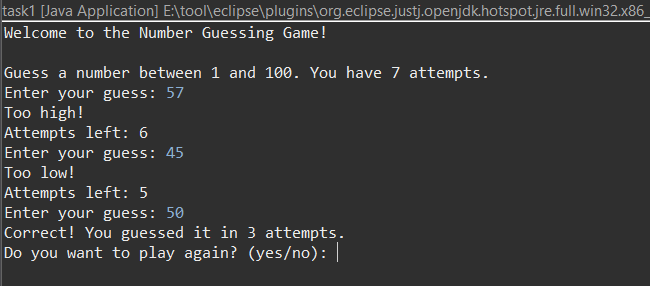

# Task 1: Number Guessing Game

This is a Java console-based game developed as part of the CodSoft Java Internship.

## 🔧 Features

- Random or fixed number to guess
- User gets feedback: Too high / Too low
- 7 attempts per round
- Option to play again
- Score tracking

## 💻 How to Run

1. Open `task1.java` in Eclipse or any Java IDE
2. Run the program
3. Follow the on-screen instructions

## 📸 Screenshot

## 🎥 Demo Video

The demo video is available in this repository.  
[Click here to download or watch demo_video.mp4](demo_video.mp4)

## 📂 GitHub Repo

This repo is part of the CodSoft internship:  
https://github.com/DivyaThakur17/CODSOFT

## 🏷 Hashtags

