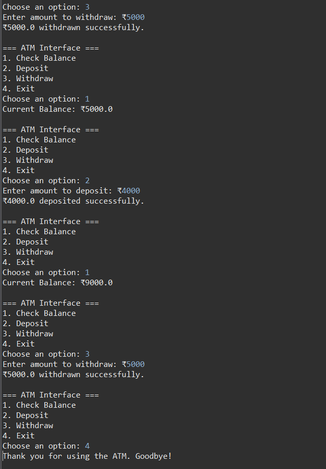

# Task 3: ATM Interface

This is a Java console-based ATM interface that allows users to check balance, deposit money, withdraw money, and exit the system.

## ✅ Features

- View current balance
- Deposit money
- Withdraw money (with balance check)
- Exit system

## 💻 How to Run

1. Open `task3.java` in Eclipse or any Java IDE
2. Run the program
3. Choose an option from the menu

## 📸 Screenshot

## 🎥 Demo Video

The demo video is available in this repository.  
[Click here to download or watch demo_video.mp4](demo_video3.mp4)

## 📂 GitHub Repo

This task is part of the CodSoft internship:  
https://github.com/DivyaThakur17/CODSOFT

## 🏷 Hashtags
#codsoft #javadevelopment #internship #task3
